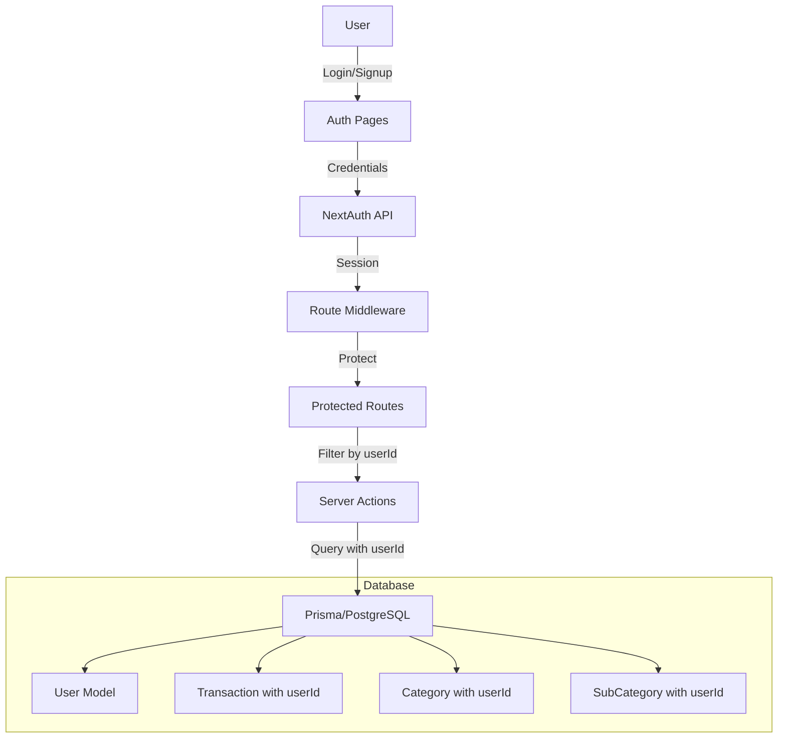

# NextAuth

Authentication Implementation

## Overview

Implement NextAuth.js (Auth.js) authentication with email/password authentication. Add user isolation so each user can only see and manage their own transactions, categories, and sub-categories.

## Architecture

## Implementation Steps

### 1. Database Schema Updates

**File: `prisma/schema.prisma`**

- Add `User` model with email, password (hashed), name, and timestamps
- Add `Account` model for NextAuth.js (for future OAuth support)
- Add `Session` model for session management
- Add `VerificationToken` model for email verification
- Add `userId` field to `Transaction`, `Category`, and `SubCategory` models
- Update unique constraints: `Category.name` should be unique per user (`@@unique([userId, name])`)
- Update `SubCategory` unique constraint to include userId
- Add indexes for userId fields for performance

### 2. Install Dependencies

**File: `package.json`**

- Add `next-auth@beta` (for Next.js 16 compatibility)
- Add `bcryptjs` and `@types/bcryptjs` for password hashing
- Add `@auth/prisma-adapter` for Prisma integration

### 3. NextAuth Configuration

**File: `lib/auth.ts`**

- Configure NextAuth with Prisma adapter
- Set up Credentials provider for email/password
- Configure session strategy (JWT or database)
- Add password hashing/verification utilities
- Export `auth` function and `signIn`, `signOut` helpers

### 4. Auth API Routes

**File: `app/api/auth/[...nextauth]/route.ts`**

- Create NextAuth API route handler
- Configure providers, callbacks, and session handling

### 5. Middleware for Route Protection

**File: `middleware.ts`**

- Protect routes: `/transactions`, `/categories`, `/upload`
- Allow public routes: `/`, `/about`, `/auth/*`
- Redirect unauthenticated users to `/auth/login`
- Handle session validation

### 6. Auth Pages

**Files:**

- `app/(auth)/login/page.tsx` - Login form with email/password
- `app/(auth)/register/page.tsx` - Registration form
- `app/(auth)/layout.tsx` - Auth layout (centered, no navbar)

### 7. Update Server Actions

**Files to update:**

- `app/(main)/transactions/actions.ts`
- Add `userId` to all queries (create, read, update, delete)
- Filter `getTransactions`, `getAllTransactions` by userId
- Add userId to `createTransaction`, `updateTransaction`
- Verify ownership in `deleteTransaction`, `updateTransaction`
- `app/(main)/categories/actions.ts`
- Add `userId` to all category/subcategory operations
- Filter queries by userId
- Update unique constraints to include userId
- `app/(main)/upload/actions.ts`
- Add userId to bulk insert operations
- Filter validation and insertion by userId

### 8. Update UI Components

**File: `components/navbar.tsx`**

- Show user email/name when authenticated
- Add logout button
- Hide protected route links when not authenticated
- Show login/register links when not authenticated

**Files: `app/(main)/transactions/page.tsx`, `app/(main)/categories/page.tsx`**

- Get session in server components
- Pass userId to server actions
- Redirect to login if not authenticated

### 9. Update Client Components

**Files:**

- `app/(main)/transactions/page-client.tsx`
- `app/(main)/categories/page-client.tsx`
- `app/(main)/upload/page-client.tsx`
- Ensure these components handle authentication state

### 10. Database Migration

- Run Prisma migration to add User model and update existing models
- Handle existing data migration (optional: assign to a default user or clear)

## Key Files to Create/Modify

### New Files:

- `lib/auth.ts` - NextAuth configuration
- `app/api/auth/[...nextauth]/route.ts` - Auth API route
- `middleware.ts` - Route protection
- `app/(auth)/login/page.tsx` - Login page
- `app/(auth)/register/page.tsx` - Register page
- `app/(auth)/layout.tsx` - Auth layout

### Modified Files:

- `prisma/schema.prisma` - Add User, Account, Session, VerificationToken models, add userId to existing models
- `app/(main)/transactions/actions.ts` - Add userId filtering
- `app/(main)/categories/actions.ts` - Add userId filtering
- `app/(main)/upload/actions.ts` - Add userId filtering
- `components/navbar.tsx` - Add auth UI
- `app/(main)/transactions/page.tsx` - Add session check
- `app/(main)/categories/page.tsx` - Add session check
- `package.json` - Add dependencies

## Security Considerations

- Passwords are hashed using bcryptjs
- Sessions are stored securely (database or JWT)
- All protected routes require authentication
- Server actions verify userId ownership before operations
- SQL injection protection via Prisma
- CSRF protection via NextAuth

## Testing Checklist

- [ ] User can register with email/password
- [ ] User can login with correct credentials
- [ ] User cannot login with wrong credentials
- [ ] Protected routes redirect to login when not authenticated
- [ ] Each user only sees their own transactions
- [ ] Each user only sees their own categories/subcategories